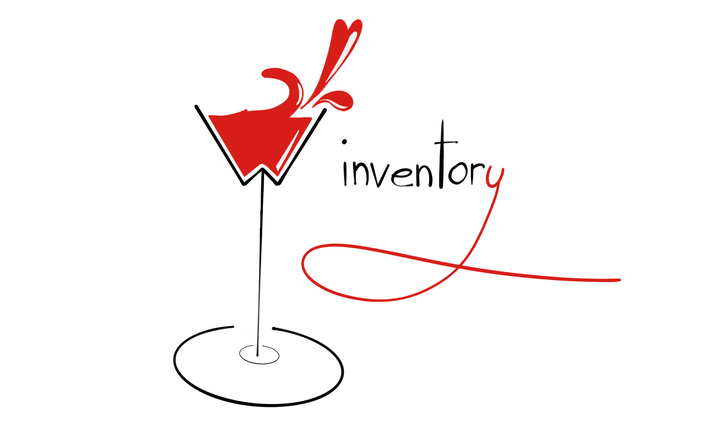

### **Table des matières**

1. [**Project Overview**](#1-project-overview)  
2. [**Project Objectives**](#2-project-objectives)  
3. [**Scope of Work & Database Structure**](#3-scope-of-work--4-database-structure)  
4. [**Constraints**](#5-constraints)  
5. [**Deliverables**](#6-deliverables)  
6. [**Timeline**](#7-timeline)  
7. [**Responsibilities**](#8-responsibilities)  
8. [**Appendices**](#9-appendices)  

---

### **1. Project Overview**

- The **Wineventory** project aims to develop a robust relational database system to manage the inventory of wine, beer, spirits, non-alcoholic beverages, aperitifs, and equipment.
- The system will provide a centralized solution for stock management, acquisition tracking, and product removals.
- **PostgreSQL** will be used for the database, focusing on supporting complex queries and providing detailed reports through an intuitive user interface.

---

### **2. Project Objectives**
- Develop a relational database capable of managing multiple product categories (wines, beers, spirits, non-alcoholic drinks, aperitifs, equipment) with category-specific attributes.
- Allow efficient stock management by monitoring inventory levels, adding/removing products, and tracking product movement across multiple locations.
- Ensure real-time stock updates with alerts for low inventory levels.
- Track the history of inventory movements with detailed reasons for product removals (sold, consumed, gifted, damaged, expired, etc.).
- Provide features to manage multiple stores, allowing for stock transfers and multi-location inventory oversight.
- Integrate customer purchase histories to optimize stock preparation and support marketing efforts (personalized offers, visit predictions).
- Ensure all SQL queries are manually written, without reliance on ORMs or intermediary query languages.

---

### **3. Scope of Work** & **4. Database Structure**
- **Product Management**: Add new products with detailed, category-specific attributes:
  - **Wine**: varietal, vintage, region, supplier, price, bottle size, alcohol percentage.
  - **Beer**: type (lager, ale), brewery, alcohol percentage, packaging (bottle, can, keg), volume.
  - **Spirits**: type (whiskey, vodka), distillery, aging period, alcohol content (description of flavour, etc.), bottle size.
  - **Non-Alcoholic Beverages**: type (soda, juice), volume, ingredients.
  - **Aperitifs**: food products such as terrines, flutes, chips, brand, packaging type, serving size.
  - **Equipment**: items like wine openers, pourers, glasses, decanters, branded items (T-shirts, aluminum signs, coasters), with attributes such as material, brand, quantity, and supplier.

- **Stock Movements**: Handle inventory removals with reasons (sold, consumed, gifted, damaged, expired, etc.) and track product additions (acquisitions, transfers, promotions).

- **Multi-Store Management**: Monitor and compare stock levels across different store locations, allowing for stock transfers and multi-location inventory oversight.

- **Customer Management**: View customer purchase history to track product preferences, suggest future visits, and offer personalized discounts or stock alerts.

- **Reports & Analytics**: Generate reports on current stock, stock movements, customer purchases, and low stock alerts.

**Database Structure**:
- **Products**: Common attributes for all products (ID, name, price, supplier).
- **Wines**: Specific attributes for wines (vintage, varietal, region, alcohol percentage).
- **Beers**: Attributes for beers (type, alcohol percentage, brewery).
- **Spirits**: Attributes for spirits (type, aging period, distillery).
- **Non-Alcoholic Beverages**: Attributes for non-alcoholic drinks (volume, ingredients).
- **Aperitifs**: Attributes for aperitifs (food products, serving size, brand).
- **Equipment**: Attributes for equipment (item type, material, brand, quantity).
- **Stock Movements**: Track product additions and removals (product ID, quantity, reason).
- **Stores**: Information on store locations (store ID, name, address).
- **Customers**: Customer details (customer ID, name, purchase history).
- **Transactions**: Customer purchases (transaction ID, customer ID, product ID, date).
- **Suppliers**: Supplier information for all products (supplier ID, name, contact info).
- **Alerts**: Track low-stock alerts (product ID, threshold, current stock).
- **Product Categories**: Store information about product categories (category ID, name, description).
- **Store Inventory**: Track stock levels per store (store ID, product ID, quantity).

---

### **5. Constraints**
- **Database**: PostgreSQL for the relational database.
- **Backend**: Java with JDBC for database connectivity, ensuring manual SQL query writing and execution.
- **Frontend**: HTML/CSS with possible use of Bootstrap for a responsive web-based interface.

---

### **6. Deliverables**
- **Project Specifications** (this document) in PDF format.
- **Conceptual Database Model** (UML schema) depicting relationships between products, customers, stores, and inventory movements.
- **Relational Database Model** based on the conceptual model, with normalized tables for each product type, store locations, customers, and transactions.
- **SQL Scripts** for creating tables, setting integrity constraints, and defining triggers or stored procedures.
- **Application Code** for the inventory management system (web or desktop) to interact with the database.
- **User Documentation** to explain the application features and user workflows.
- **Installation Guide** for setting up the database and the application.
- **Presentation Slides** for a 10-15 minute presentation on the project’s design and implementation.

---

### **7. Timeline**
- **Project Specifications Submission**: October 13, 2024.
- **Conceptual Database Design (EA Diagram)**: TBD.
- **Relational Database Design and SQL Scripts**: TBD.
- **Application Development**: To be done iteratively with parallel database modeling and development.
- **Final Submission & Presentation**: January 24, 2025.

---

### **8. Appendices**
- **UML Diagram**: The conceptual schema of the database, including entity relationships for products, customers, and transactions.
- **SQL Scripts**: Scripts for creating tables, establishing relationships, and defining constraints.
- **Technical Documentation**: A detailed explanation of the design choices, the handling of different product types, and how PostgreSQL is leveraged for complex queries.
