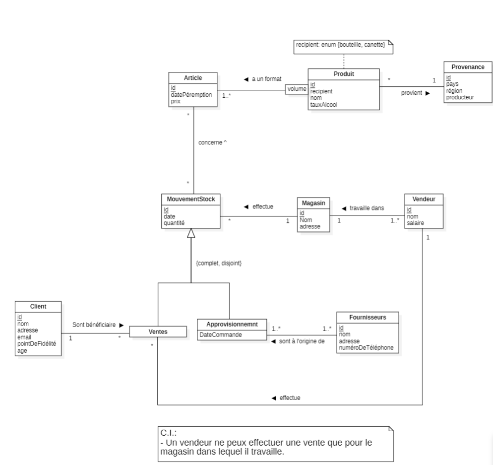

# Projet de BDR

## Descriptif

Réaliser, par groupe de 3, une application complète de base de données relationnelle

Le projet comprendra les étapes suivantes :

- **Etape 1 : Cahier des charges**<br/>
    Description détaillée de l’analyse des besoins. Cette analyse comprendra à la fois les
    besoins en données et les besoins fonctionnels.
    
- **Etape 2 : Modélisation conceptuelle**<br/>
    Réalisation du schéma conceptuel (schéma EA au format UML) de la base de données.
    
- **Etape 3 : Modélisation relationnelle**<br/>
    Transformer le schéma EA en schéma relationnel.<br/>
    Création de la base de données (script SQL) contenant les tables et les contraintes
    d’intégrités référentielles.
    
- **Etape 4 : Requêtes, vues et triggers/procédures stockées**<br/>
    Ecriture des requêtes qui seront utilisées dans l’application.<br/>
    Création des vues, triggers/procédures stockées dans la base de données.
    
- **Etape 5 : Application**<br/>
    Réalisation de l’application web ou desktop.<br/>
    Utilisation d’une API de connexion de l’application à la base de données (par ex JDBC).<br/>
    Cette étape peut être commencée avant que les précédentes ne soient finies, c’est même
    recommandé.
    

## Instructions générales

- La base de données doit être en PostgreSQL
- Une interface graphique claire et fonctionnelle suffit <br/>
  L’effort doit être mis sur la partie base de données
- Langages recommandés : <br/>
       o Java <br/> 
       o C#  <br/>
       o PHP <br/> 
- Technologies autorisées :<br/>
  o Librairies graphiques (Bootstrap, JavaFX, …)
  o Frameworks (Blazor, Play, …) 
Il n’y a aucune obligation d’en utiliser, il est même souvent préférable de ne pas les
utiliser si vous n’avez aucunes connaissances préalables dans ces technologies.
- Toutes les requêtes doivent être écrites "à la main" en SQL (pas avec des "langages
intermédiaires" tels que LINQ ni des ORM)


**Tous les livrables sont à déposer sur Cyberlearn** <br/>
La note sera mise sur le rendu final (avec la présentation), les rendus précédents (étapes 1
à 3) donneront lieu à un feedback non noté.

## Rapport
Le rapport devra être complet, son contenu (schémas, …) être à jour, et contenir au moins :
- Une page de titre et une table des matières
- Une introduction/description du projet
- Le modèle EA (schéma + descriptions)
- Le modèle relationnel
- La description de l’application réalisée (manuel utilisateur)
- Une liste des éventuels bugs connus
- Une conclusion
- Des annexes (guide d’installation/de déploiement, …)

## Deadlines

|Livrables|Date de remise|
|---------|:------------:|
|**Etape 1:** <br/>Cahier des charges|**13.10.2024** <br/>23h59|
|**Etape 2:** <br/>Schéma UML|06.11.2024 <br/>23h59|
|**Etape 3:** <br/>- Schéma relationnel<br/>- Fichier de script SQL de création de la base des données(tables et contrainte d'intégrité référentielle) et insertion des tuples initiaux|01.12.2024|
|**Présentation:** <br/>- Durée: 10-15 minutes par groupe (7-10 slides)<br/>- Description du projet, shéma EA, choix d'implémentation, démo...<br/>**A remettre:** slides de présentation|**24.01.2025** <br/>10h25|
|**Rendu final:** <br/>- Rapport au format PDF<br/>- Le script SQL complet de la création de l abse de données<br/>- Le code source de l'application|A déterminer|

# Notre projet - Winventory
 ## Cahier des charges 
[Cahier des charges](CdC.md)

## Modélisation conceptuelle (UML)


## Modèle Relationnel

```
Provenance(<u>id</u>, pays, région, producteur)

Produit(<u>id</u>, idProvenance, nom, tauxAlcool)
    Produit.idProvenance référence Provenance.id
    Produit.idProvenance NOT NULL et UNIQUE

Article(<u>id, idProduit, volume, recipient</u>, datePeremption, prix)
    Article.idProduit référence Produit.id

MouvementStock(<u>id</u>, idMagasin, idArticle, date, quantite)
    MouvementStock.idMagasin référence Magasin.id
    MouvementStock.idMagasin NOT NULL et UNIQUE
    MouvementStock.idArticle référence Article.id NOT NULL et UNIQUE

Magasin(<u>id</u>, nom, adresse)

Vendeur(<u>id</u>, idMagasin, nom, salaire)
    Vendeur.idMagasin référence Magasin.id
    Vendeur.idMagasin NOT NULL et UNIQUE

Vente(<u>idMouvementStockt</u>, idVendeur, idClient)
    Vente.idMouvementStock référence MouvementStock.id
    Vente.idVendeur référence Vendeur.id
    Vente.idVendeur NOT NULL et UNIQUE
    Vente.idClient référence Client.id
    Vente.idClient NOT NULL et UNIQUE

Approvisionnement(<u>idMouvementStock</u>, dateCommande)
    Approvisionnement.idMouvementStock référence MouvementStock.id

Client(<u>id</u>, nom, adresse, email, pointDeFidelite, annéeNaissance)

Fournisseur(<u>id</u>, nom, adresse, numeroTelephone)

Approvisionnement_Fournisseur(<u>idMouvementStock, idFournisseur</u>)
    Approvisionnement_Fournisseur.idMouvementStock référence MouvementStock.id
    Approvisionnement_Fournisseur.idFournisseur référence Fournisseur.id

Article_MouvementStock(<u>idArticle, idMouvementStock</u>)
    Article_MouvementStock.idArticle référence Article.id
    Article_MouvementStock.idMouvementStock référence MouvementStock.id
  
```


## Création des tables SQL

```
CREATE TABLE IF NOT EXIST Provenance(
    id serial,
    pays varchar(80),
    region varchar(80),
    CONSTRAINT PK_Provenance PRIMARY KEY (id)
);

CREATE TYPE typeRecipient AS ENUM ('bouteille','canette');

CREATE TABLE IF NOT EXIST Produit(
    id serial,
    idProduit integer NOT NULL UNIQUE,
    recipient typeRecipient,
    nom varchar(80),
    tauxAlcool double PRECISION,
    CONSTRAINT PK_Produit PRIMARY KEY (id),
    CONSTRAINT FK_Produit_Produit FOREIGN KEY (idProduit) REFERENCES Produit(id) ON UPDATE CASCADE ON DELETE CASCADE
);

CREATE TABLE IF NOT EXIST Article(
    id serial,
    idProduit integer,
    volume integer,
    datePeremption Date,
    prix double PRECISION,
    CONSTRAINT PK_Article PRIMARY KEY (id, idProduit, volume),
    CONSTRAINT FK_Article_Produit FOREIGN KEY (idProduit) REFERENCES Produit(id) ON UPDATE CASCADE ON DELETE CASCADE
);

CREATE TABLE IF NOT EXIST MouvementStock(
    id serial,
    idMagasin integer NOT NULL UNIQUE,
    idArticle integer NOT NULL UNIQUE,
    date Date,
    quantite integer,
    CONSTRAINT PK_MouvementStock PRIMARY KEY (id),
    CONSTRAINT FK_MouvementStock_Magasin FOREIGN KEY (idMagasin) REFERENCES Magasin(id) ON UPDATE CASCADE ON DELETE CASCADE
    CONSTRAINT FK_MouvementStock_Article FOREIGN KEY (idArticle) REFERENCES Article(id) ON UPDATE CASCADE ON DELETE CASCADE
);

CREATE TABLE IF NOT EXIST Magasin(
    id serial,
    nom varchar(80),
    adresse varchar(350),
    CONSTRAINT PK_Magasin PRIMARY KEY (id)
);

CREATE TABLE IF NOT EXIST Vendeur(
    id serial,
    idMagasin integer NOT NULL UNIQUE,
    nom varchar(80),
    salaire double PRECISION,
    CONSTRAINT PK_Vendeur PRIMARY KEY (id),
    CONSTRAINT FK_Vendeur_Magasin FOREIGN KEY (idMagasin) REFERENCES Magasin(id) ON UPDATE CASCADE ON DELETE CASCADE
);

CREATE TABLE IF NOT EXIST Vente(
    idMouvementStock integer,
    idVendeur integer NOT NULL UNIQUE,
    idClient integer NOT NULL UNIQUE,
    CONSTRAINT PK_Vente PRIMARY KEY (idMouvementStock),
    CONSTRAINT FK_Vente_Vendeur FOREIGN KEY (idMouvementStock) REFERENCES MouvementStock(id) ON UPDATE CASCADE ON DELETE CASCADE
    CONSTRAINT FK_Vente_Client FOREIGN KEY (idClient) REFERENCES Client(id) ON UPDATE CASCADE ON DELETE CASCADE
);

CREATE TABLE IF NOT EXIST Approvisionnement(
    idMouvementStock integer,
    dateCommande DATE,
    CONSTRAINT PK_Approvisionnement PRIMARY KEY (idMouvementStock),
    CONSTRAINT FK_Approvisionnement FOREIGN KEY (idMouvementStock) REFERENCES MouvementStock(id) ON UPDATE CASCADE ON DELETE CASCADE
    CONSTRAINT checkDate check (dateCommande < CURRENT_DATE)
);

CREATE TABLE IF NOT EXIST Client(
    id serial,
    nom varchar(80),
    adresse varchar(150),
    pointDeFidelite integer,
    anneeNaissance integer
    CONSTRAINT PK_Client PRIMARY KEY (id)
);

CREATE TABLE IF NOT EXIST Fournisseur(
    id serial,
    nom varchar(80),
    adresse varchar(150),
    numeroTelephone varchar(30)
);

CREATE TABLE IF NOT EXIST Approvisionnement_Fournisseur(
    idMouvementStock integer,
    idFournisseur integer,
    CONSTRAINT PK_Approvisionnement_Fournisseur PRIMARY KEY (idMouvementStock, idFournissseur),
    CONSTRAINT FK_Approvisionnement_Fournisseur_idMouvementStock FOREIGN KEY (idMouvementStock) REFERENCES Approvisionnement(idMouvementStock),
    CONSTRAINT FK_Approvisionnement_Fournisseur_idFournisseur FOREIGN KEY (idFournisseur) REFERENCES Fournisseur(idFournisseur)
);

```
