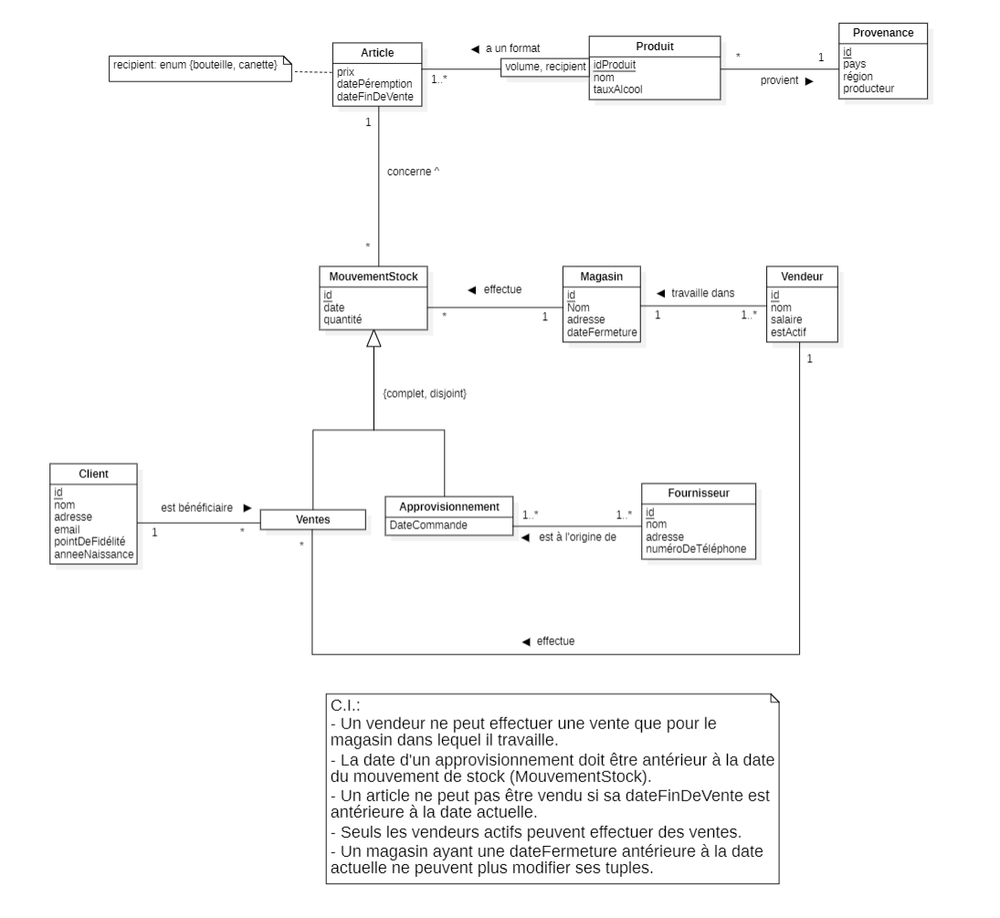

# Projet de BDR

## Descriptif

Réaliser, par groupe de 3, une application complète de base de données relationnelle

Le projet comprendra les étapes suivantes :

- **Etape 1 : Cahier des charges**<br/>
  Description détaillée de l’analyse des besoins. Cette analyse comprendra à la fois les
  besoins en données et les besoins fonctionnels.

- **Etape 2 : Modélisation conceptuelle**<br/>
  Réalisation du schéma conceptuel (schéma EA au format UML) de la base de données.

- **Etape 3 : Modélisation relationnelle**<br/>
  Transformer le schéma EA en schéma relationnel.<br/>
  Création de la base de données (script SQL) contenant les tables et les contraintes
  d’intégrités référentielles.

- **Etape 4 : Requêtes, vues et triggers/procédures stockées**<br/>
  Ecriture des requêtes qui seront utilisées dans l’application.<br/>
  Création des vues, triggers/procédures stockées dans la base de données.

- **Etape 5 : Application**<br/>
  Réalisation de l’application web ou desktop.<br/>
  Utilisation d’une API de connexion de l’application à la base de données (par ex JDBC).<br/>
  Cette étape peut être commencée avant que les précédentes ne soient finies, c’est même
  recommandé.

## Instructions générales

- La base de données doit être en PostgreSQL
- Une interface graphique claire et fonctionnelle suffit <br/>
  L’effort doit être mis sur la partie base de données
- Langages recommandés : <br/>
  o Java <br/>
  o C#  <br/>
  o PHP <br/>
- Technologies autorisées :<br/>
  o Librairies graphiques (Bootstrap, JavaFX, …)
  o Frameworks (Blazor, Play, …)
  Il n’y a aucune obligation d’en utiliser, il est même souvent préférable de ne pas les
  utiliser si vous n’avez aucunes connaissances préalables dans ces technologies.
- Toutes les requêtes doivent être écrites "à la main" en SQL (pas avec des "langages
  intermédiaires" tels que LINQ ni des ORM)

**Tous les livrables sont à déposer sur Cyberlearn** <br/>
La note sera mise sur le rendu final (avec la présentation), les rendus précédents (étapes 1
à 3) donneront lieu à un feedback non noté.

## Rapport

Le rapport devra être complet, son contenu (schémas, …) être à jour, et contenir au moins :

- Une page de titre et une table des matières
- Une introduction/description du projet
- Le modèle EA (schéma + descriptions)
- Le modèle relationnel
- La description de l’application réalisée (manuel utilisateur)
- Une liste des éventuels bugs connus
- Une conclusion
- Des annexes (guide d’installation/de déploiement, …)

## Deadlines

| Livrables                                                                                                                                                                                |      Date de remise       |
|------------------------------------------------------------------------------------------------------------------------------------------------------------------------------------------|:-------------------------:|
| **Etape 1:** <br/>Cahier des charges                                                                                                                                                     | **13.10.2024** <br/>23h59 |
| **Etape 2:** <br/>Schéma UML                                                                                                                                                             | **06.11.2024** <br/>23h59 |
| **Etape 3:** <br/>- Schéma relationnel<br/>- Fichier de script SQL de création de la base des données(tables et contrainte d'intégrité référentielle) et insertion des tuples initiaux   | **01.12.2024**</br>23h59  |
| **Présentation:** <br/>- Durée: 10-15 minutes par groupe (7-10 slides)<br/>- Description du projet, shéma EA, choix d'implémentation, démo...<br/>**A remettre:** slides de présentation | **24.01.2025** <br/>10h25 |
| **Rendu final:** <br/>- Rapport au format PDF<br/>- Le script SQL complet de la création de la base de données<br/>- Le code source de l'application                                     |       **26.01.2025**<br/>23h59        |

# Notre projet - Winventory

## Cahier des charges

[Cahier des charges](HEIG/CdC.md)

## Modélisation conceptuelle (UML)



## Modèle Relationnel

Voici le modèle relationnel de notre projet:

```
Provenance(<u>id</u>, pays, région, producteur)

Produit(<u>idProduit</u>, idProvenance, nom, tauxAlcool)
    Produit.idProvenance référence Provenance.id
    Produit.idProvenance NOT NULL

Article(<u>idProduit, volume, recipient</u>, prix, datePeremption, dateFinDeVente)
    Article.idProduit référence Produit.id

MouvementStock(<u>id</u>, idMagasin, idProduit, volume, recipient, date, quantite)
    MouvementStock.idMagasin référence Magasin.id
    MouvementStock.idProduit, volume, recipient référence Article.idProduit, volume, recipient
    MouvementStock.idProduit, volume, recipient NOT NULL

Magasin(<u>id</u>, nom, adresse, dateFermeture)

Vendeur(<u>id</u>, idMagasin, nom, salaire, estActif)
    Vendeur.idMagasin référence Magasin.id
    Vendeur.idMagasin NOT NULL

Vente(<u>idMouvementStockt</u>, idVendeur, idClient)
    Vente.idMouvementStock référence MouvementStock.id
    Vente.idVendeur référence Vendeur.id
    Vente.idVendeur NOT NULL
    Vente.idClient référence Client.id
    Vente.idClient NOT NULL

Approvisionnement(<u>idMouvementStock</u>, dateCommande)
    Approvisionnement.idMouvementStock référence MouvementStock.id

Client(<u>id</u>, nom, adresse, email, pointDeFidelite, annéeNaissance)
    Client.email UNIQUE

Fournisseur(<u>id</u>, nom, adresse, numeroTelephone)

Approvisionnement_Fournisseur(<u>idMouvementStock, idFournisseur</u>)
    Approvisionnement_Fournisseur.idMouvementStock référence MouvementStock.id
    Approvisionnement_Fournisseur.idFournisseur référence Fournisseur.id
  
```

## Création des tables SQL

Voici le script SQL utilisé pour créer les tables de notre projet :

```
CREATE TABLE IF NOT EXISTS Provenance(
    id SERIAL,
    pays VARCHAR(80),
    region VARCHAR(80),
    producteur VARCHAR(80),
    CONSTRAINT PK_Provenance PRIMARY KEY (id)
);

--CREATE TYPE typeRecipient AS ENUM ('bouteille', 'canette');

CREATE TABLE IF NOT EXISTS Produit(
    id SERIAL,
    idProduit INTEGER NOT NULL,
    nom VARCHAR(80) NOT NULL,
    tauxAlcool DOUBLE PRECISION NOT NULL,
    CONSTRAINT PK_Produit PRIMARY KEY (id)
);

CREATE TABLE IF NOT EXISTS Article(
    idProduit INTEGER,
    volume INTEGER,
    recipient typeRecipient,
    prix DOUBLE PRECISION NOT NULL,
    datePeremption DATE NOT NULL,
    dateFinDeVente DATE,
    CONSTRAINT PK_Article PRIMARY KEY (idProduit, volume, recipient),
    CONSTRAINT FK_Article_Produit FOREIGN KEY (idProduit) REFERENCES Produit(id) ON UPDATE CASCADE ON DELETE RESTRICT
);

CREATE TABLE IF NOT EXISTS Magasin(
    id SERIAL,
    nom VARCHAR(80) NOT NULL,
    adresse VARCHAR(350) NOT NULL,
    dateFermeture DATE,
    CONSTRAINT PK_Magasin PRIMARY KEY (id)
);

CREATE TABLE IF NOT EXISTS MouvementStock(
    id SERIAL,
    idMagasin INTEGER NOT NULL,
    idProduit INTEGER NOT NULL,
    volume INTEGER NOT NULL,
    recipient typeRecipient NOT NULL,
    date DATE,
    quantite INTEGER,
    CONSTRAINT PK_MouvementStock PRIMARY KEY (id),
    CONSTRAINT FK_MouvementStock_Magasin FOREIGN KEY (idMagasin) REFERENCES Magasin(id) ON UPDATE CASCADE ON DELETE CASCADE,
    CONSTRAINT FK_MouvementStock_Article FOREIGN KEY (idProduit, volume, recipient) REFERENCES Article(idProduit, volume, recipient) ON UPDATE CASCADE ON DELETE CASCADE
);

CREATE TABLE IF NOT EXISTS Vendeur(
    id SERIAL,
    idMagasin INTEGER NOT NULL,
    nom VARCHAR(80),
    salaire DOUBLE PRECISION,
    estActif BOOL NOT NULL,
    CONSTRAINT PK_Vendeur PRIMARY KEY (id),
    CONSTRAINT FK_Vendeur_Magasin FOREIGN KEY (idMagasin) REFERENCES Magasin(id) ON UPDATE CASCADE ON DELETE CASCADE
);

CREATE TABLE IF NOT EXISTS Client(
    id SERIAL,
    nom VARCHAR(80),
    adresse VARCHAR(150),
    email VARCHAR(100) UNIQUE,
    pointDeFidelite INTEGER,
    anneeNaissance INTEGER,
    CONSTRAINT PK_Client PRIMARY KEY (id)
);

CREATE TABLE IF NOT EXISTS Vente(
    idMouvementStock INTEGER,
    idVendeur INTEGER NOT NULL,
    idClient INTEGER NOT NULL,
    CONSTRAINT PK_Vente PRIMARY KEY (idMouvementStock),
    CONSTRAINT FK_Vente_MouvementStock FOREIGN KEY (idMouvementStock) REFERENCES MouvementStock(id) ON UPDATE CASCADE ON DELETE CASCADE,
    CONSTRAINT FK_Vente_Vendeur FOREIGN KEY (idVendeur) REFERENCES Vendeur(id) ON UPDATE CASCADE ON DELETE RESTRICT,
    CONSTRAINT FK_Vente_Client FOREIGN KEY (idClient) REFERENCES Client(id) ON UPDATE CASCADE ON DELETE RESTRICT
);

CREATE TABLE IF NOT EXISTS Approvisionnement(
    idMouvementStock INTEGER,
    dateCommande DATE NOT NULL,
    CONSTRAINT PK_Approvisionnement PRIMARY KEY (idMouvementStock),
    CONSTRAINT FK_Approvisionnement_Approvisionnement FOREIGN KEY (idMouvementStock) REFERENCES MouvementStock(id) ON UPDATE CASCADE ON DELETE CASCADE,
    CONSTRAINT check_DateCommande CHECK (dateCommande < CURRENT_DATE)
);

CREATE TABLE IF NOT EXISTS Fournisseur(
    id SERIAL,
    nom VARCHAR(80),
    adresse VARCHAR(150),
    numeroTelephone VARCHAR(30),
    CONSTRAINT PK_Fournisseur PRIMARY KEY (id)
);

CREATE TABLE IF NOT EXISTS Approvisionnement_Fournisseur(
    idMouvementStock INTEGER,
    idFournisseur INTEGER,
    CONSTRAINT PK_Approvisionnement_Fournisseur PRIMARY KEY (idMouvementStock, idFournisseur),
    CONSTRAINT FK_Approvisionnement_Fournisseur_idMouvementStock FOREIGN KEY (idMouvementStock) REFERENCES Approvisionnement(idMouvementStock) ON UPDATE CASCADE ON DELETE CASCADE,
    CONSTRAINT FK_Approvisionnement_Fournisseur_idFournisseur FOREIGN KEY (idFournisseur) REFERENCES Fournisseur(id) ON UPDATE CASCADE ON DELETE CASCADE
);
```

## Remplissage des tables SQL

Voici le script SQL utilisé pour remplir les tables de notre projet :

```
-- Remplissage de la table Provenance
INSERT INTO Provenance (pays, region, producteur) VALUES
('France', 'Bordeaux', 'Château Margaux'),
('Espagne', 'Ribera del Duero', 'Bodega Vega Sicilia'),
('Italie', 'Toscane', 'Antinori'),
('France', 'Champagne', 'Moët & Chandon'),
('USA', 'Napa Valley', 'Robert Mondavi');

-- Remplissage de la table Produit
INSERT INTO Produit (idProduit, nom, tauxAlcool) VALUES
(1, 'Vin Rouge Bordeaux', 13.5),
(2, 'Vin Blanc Chardonnay', 12.0),
(3, 'Champagne Brut', 12.5),
(4, 'Whiskey Single Malt', 40.0),
(5, 'Bière Blonde', 5.0);

-- Remplissage de la table Article
INSERT INTO Article (idProduit, volume, recipient, datePeremption, prix) VALUES
(1, 750, 'bouteille', '2025-12-31', 45.99),
(1, 1500, 'bouteille', '2025-12-31', 89.99),
(2, 750, 'bouteille', '2024-11-30', 35.99),
(3, 750, 'bouteille', '2026-06-30', 55.00),
(4, 700, 'bouteille', '2030-01-01', 120.00),
(5, 330, 'canette', '2023-12-31', 2.50);

-- Remplissage de la table Magasin
INSERT INTO Magasin (nom, adresse) VALUES
('Cave de Paris', '12 rue de la Paix, Paris, France'),
('Wine World', '45 High Street, London, UK'),
('Enoteca Roma', 'Via Condotti, 25, Rome, Italy');

-- Remplissage de la table MouvementStock
INSERT INTO MouvementStock (idMagasin, idProduit, volume, recipient, date, quantite) VALUES
(1, 1, 750, 'bouteille', '2024-01-10', 100),
(1, 2, 750, 'bouteille', '2024-01-15', 50),
(2, 3, 750, 'bouteille', '2024-01-20', 30),
(2, 5, 330, 'canette', '2023-12-01', 500),
(3, 4, 700, 'bouteille', '2023-11-25', 20);

-- Remplissage de la table Vendeur
INSERT INTO Vendeur (idMagasin, nom, salaire) VALUES
(1, 'Alice Dupont', 2500.00),
(2, 'John Smith', 2200.00),
(3, 'Giulia Rossi', 2400.00);

-- Remplissage de la table Client
INSERT INTO Client (nom, adresse, email, pointDeFidelite, anneeNaissance) VALUES
('Paul Morel', '34 avenue des Champs, Paris, France', 'paul.morel@example.com', 120, 1985),
('Anna Garcia', '23 Carrer Major, Barcelona, Spain', 'anna.garcia@example.com', 80, 1990),
('James Taylor', '56 Broadway, New York, USA', 'james.taylor@example.com', 200, 1980);

-- Remplissage de la table Vente
INSERT INTO Vente (idMouvementStock, idVendeur, idClient) VALUES
(1, 1, 1),
(2, 1, 2),
(3, 2, 3);

-- Remplissage de la table Approvisionnement
INSERT INTO Approvisionnement (idMouvementStock, dateCommande) VALUES
(4, '2023-11-01'),
(5, '2023-10-15');

-- Remplissage de la table Fournisseur
INSERT INTO Fournisseur (nom, adresse, numeroTelephone) VALUES
('Distrib Vins France', '45 rue du Vin, Bordeaux, France', '+33 5 56 00 00 01'),
('Champagne Select', '12 avenue de la Champagne, Reims, France', '+33 3 26 00 00 02'),
('Global Spirits', '99 Whiskey Lane, Dublin, Ireland', '+353 1 00 00 03');

-- Remplissage de la table Approvisionnement_Fournisseur
INSERT INTO Approvisionnement_Fournisseur (idMouvementStock, idFournisseur) VALUES
(4, 1),
(5, 3);
```
